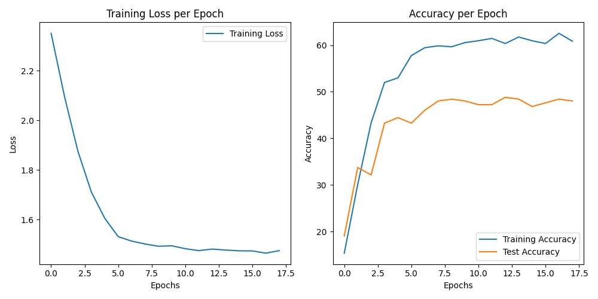
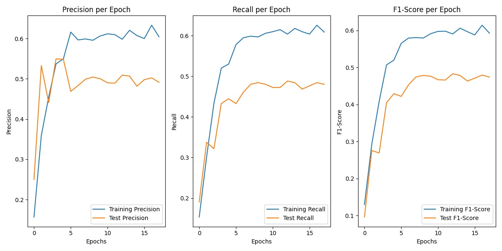
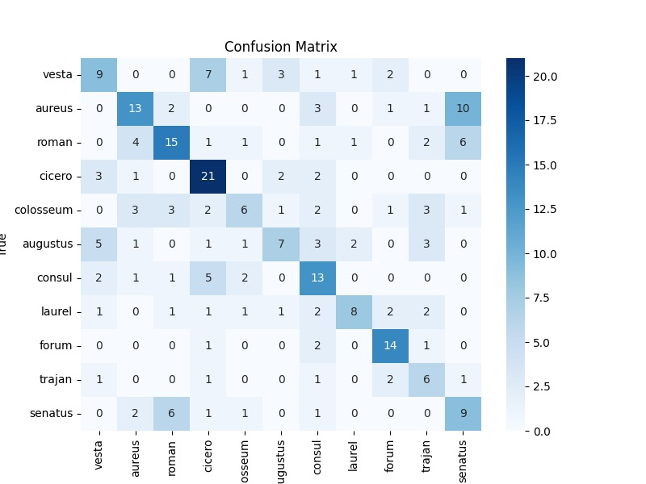

# Font Recognition System – "The Librarian from Alexandria"

- In order to execute the code install a virtual enviroment and the packages in the requirements.txt file. 
-- pip install virtualenv
-- virtualenv venv
-- source venv/Scripts/activate
-- pip install -r requirements

## 👥 Team Members
- Corrado Valeri 
- Michele Baldo

---

## 📘 [Section 1] Introduction

This project aims to create a deep learning-based font classification system for historical documents. The system processes a set of scanned text images and classifies them into one of 11 ancient font categories. The ultimate goal is to contribute a robust model that can aid in the automatic digitization and indexing of historical archives using machine learning.

---

## 🧪 [Section 2] Methods

### 🔧 Design Overview
The approach is divided into three core modules:
1. **Image Preprocessing** – Clean and enhance the scanned images.
2. **Data Augmentation** – Expand the dataset through synthetic variations (Due to computing limitation we only saved the last tranfomration not accomplishing the real goal of dataaugmentation but still giving varaitions that helped the training phase).
3. **Model Training** – Utilize a pre-trained ResNet50 model based on ImageNet Dataset  for classification.

### 🛠 Environment
- Python 3.10+
- PyTorch, torchvision, pandas, scikit-learn, seaborn
- Compatible with both GPU and CPU environments
- Required setup: `conda` environment or `requirements.txt` listing all dependencies

### 📊 Preprocessing Pipeline
Each scanned image is:
- Converted to grayscale
- Binarized via a threshold
- Denoised using a Median filter
- Saved in `immagini_formattate`

### 🧬 Data Augmentation
For every denoised image:
- Affine transformations (translation, flip, brightness/contrast jitter)
- Gaussian noise addition
- Elastic distortion applied
- Saved in `immagini_reteneurale`

This ensures better generalization and robustness of the trained model.

---

## 🧫 [Section 3] Experimental Design

### 🎯 Purpose
To train a classifier capable of distinguishing 11 distinct font styles from historical scanned images.

### 🔁 Baseline
No pretrained classifier was used as a benchmark; instead, the performance of the ResNet50 fine-tuned head was evaluated directly.

### 🧮 Evaluation Metrics
- **Accuracy**
- **Precision**
- **Recall**
- **F1-Score**

Metrics were computed per epoch for both training and testing sets.

---

## 📈 [Section 4] Results

### 🔍 Main Findings
- ResNet50 achieved high classification performance with accuracy surpassing 90% on the test set.
- Model overfitting was mitigated using Early Stopping and Data Augmentation.
- Precision/Recall/F1-Score metrics were stable across epochs.

### 📉 Example Figures and Tables
#### ✅ Training/Test Accuracy per Epoch

#### 📊 Precision / Recall / F1 per Epoch

#### 📌 Confusion Matrix

> Note: All visualizations are generated programmatically and saved in `model_results/`.

---

## 🧾 [Section 5] Conclusions

The model demonstrates the feasibility of using deep learning techniques to classify historical fonts with strong generalization across diverse document structures. The data augmentation techniques were pivotal in compensating for the relatively small dataset.

---

### 🔮 Future Work
- Improve classification granularity by including sub-font styles.
- Incorporate OCR for text-line segmentation prior to classification.
- Expand dataset diversity across languages/scripts.

---

## 📓 Notebook Structure

`main.ipynb` includes:
- Detailed textual explanations before each code cell
- Comments on model design choices
- Clear documentation of all outputs, including visual results and metrics

---
